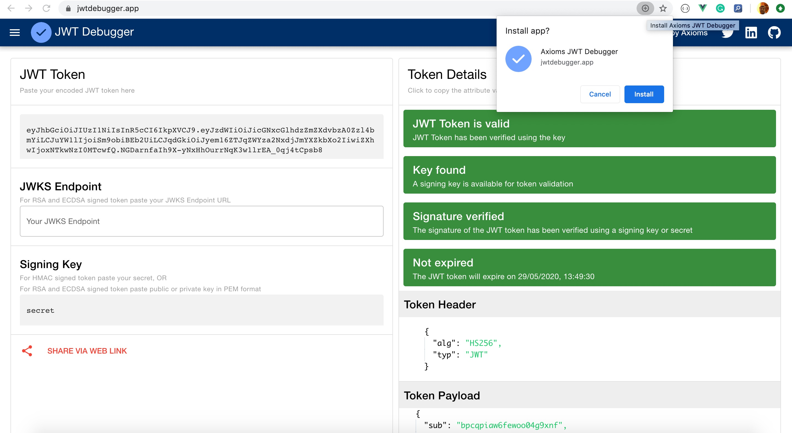
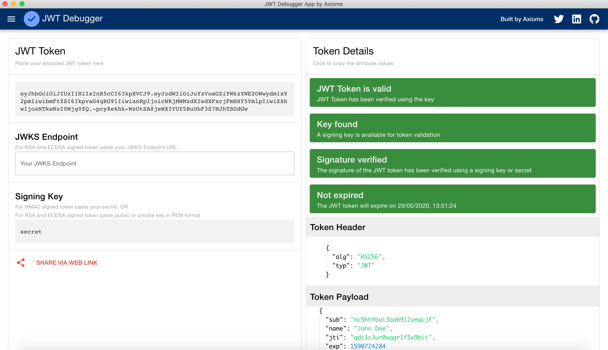

# Axioms JWT Debugger
Parse and validate a JSON Web Token (JWT).

- Web version with offline support using progress web app 

- Desktop versions for Windows, Mac, and Linux (Debian)

# Token Validation

- Using JSON Web Key Set (JWKS) Endpoint for token signed using `RSA` and `ECDSA` algorithms.
- Using Secret Key for token signed using `HMAC` algorithms.

# Bug and feature request
Please use Github issues to create any bugs or feature request.

